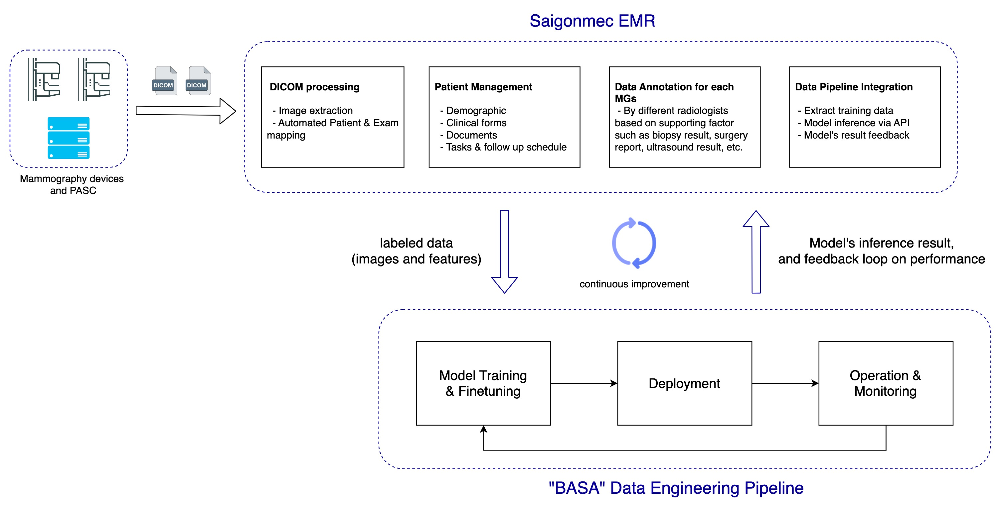
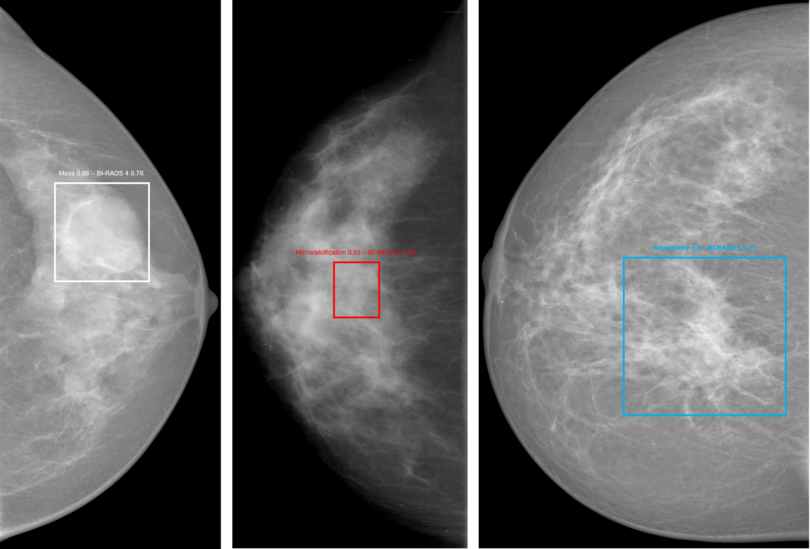

# Introduction
The "Breast Cancer Assistant System for Medical AI" or [BASA](https://github.com/saigonmec/basa) is part of an end-to-end open-source platform for development and deployment of mammography-based AI models in the clinical setting.

The platform has two integrated parts: [Saigonmec EMR](https://github.com/saigonmec/saigonmec-emr) and the [BASA](https://github.com/saigonmec/basa) Data Engineering Pipeline (this repo). The following diagram shows an overview of the platform:

Some highlights of the BASA pipeline:
  - Structure to reproduce/finetune the base model or develop new AI models
  - Ready-to-deploy pre-trained AI model
  - Supporting tools for production deployments and monitoring in the clinical setting.

# About the model
The core AI model in BASA consists of three tasks built upon the Faster RCNN architecture: 
  - lesion classification
  - BI-RADS classification
  - and cancer localization

We conducted experiments using various backbones, starting from the ResNet family and progressing to ConvNext or other state-of-the-art models. 

The lesion ground truths were derived from the biopsy reports, while the BI-RADS prediction leverages information gathered from how radiologists read and score the lesion following the 2013 standardized BI-RADS system. 

Additionally, we reference the surgery procedure's reports in order to ensure the correct annotation of the lesion location.

We make the source code of our end-to-end platform publicly available for other scientists to evaluate or build on our work. 
Moreover, we ensure that our model requires low memory so that it can be operated in a low resource hospital environment. 
Given that several previous works with high performance have been published, reproducing them can be challenging due to hardware limitations or the non-publication of the necessary source code.

We hope that the rich resources provided here will facilitate the scientific community in tackling the challenge of breast cancer with AI, and advancing medical AI adoption in general.

# Documentation

The work is currently in progress, and we are making our entire platform publicly available in 2024. It is essential for us to conduct a thorough evaluation of the platform and the core AI model to ensure that their reliability, responsibility, and safety align with the demands of real clinical scenarios. 

# Model Development

The core AI model of BASA was trained on our private dataset, which currently includes 1,000 patients with annotated mammograms. As a prospective study, the number of patients used for training and finetuning is expected to increase even more in the future (20 times).

The below image illustrates our training pipeline. 
All input images are preprocessed in (1): 
- first, the breast regions are cropped and separated from the background of the mammograms to reduce noise; 
- second, using sliding windows technique to crop the breast regions into smaller slides after a step of 200 pixels, which makes the detection of the lesion-containing regions even more sensitive. 
- Each sliding window image is fed into the AI model (Faster RCNN Multi Task Learning Network, or FMTLN) (2), which can be used to train or finetune the model. 

The architecture of FMTLN can be seen at (3). The predicted slides are output at the final stage of the model, and ultimately, are concatenated to generate the final output of the input breast in the beginning. 

 

Preliminary results: Lesions and types detection

| Backbone                                                                                | mean Average Precision (mAP@.5) | AP@.5 Architectural distortion | AP@.5 Asymmetry | AP@.5 Mass | AP@.5 Microcalcification |
| ------------------------------------------------------------------------------------ | --------------------- | -------------------- | ------------------------------ | ----------------------------------- | ------------------ |
| [FMTLN - ResNet50] | 0.7737                   | 0.8983                 | 0.7440                           | 0.7060                                | 0.7650 |
| [FMTLN - ResNet101]| 0.7323                  | 0.9031                 | 0.6600                          | 0.7730                                | 0.5760               |
| [FMTLN - ResNet152] | 0.7889                   | 0.9323                 | 0.6690                         | 0.8010                               | 0.6860               |

 

Preliminary results: Lesions and BI-RADS scores detection

| Backbone                                                                                | mean Average Precision (mAP@.5) | AP@.5 BI-RADS 2 | AP@.5 BI-RADS 3 | AP@.5 BI-RADS 4| AP@.5 BI-RADS 5 | AP@.5 BI-RADS 6 |
| ------------------------------------------------------------------------------------ | --------------------- | -------------------- | ------------------------------ | ----------------------------------- | ------------------ |  ------------------ |
| [FMTLN - ResNet50] | 0.8069                   | 0.3330                 | 0.9030                           | 0.9230                                | 0.8347 | 0.8750 |
| [FMTLN - ResNet101]| 0.8628                  | 0.6670                 | 0.8330                          | 0.9090                                | 0.8511               | 0.9050
| [FMTLN - ResNet152] | 0.8826                   | 0.6670                 | 0.8330                         | 0.9460                               | 0.8799              | 0.9130 |

 

# Sample output of the model

# Contribute

We love your support! This project cannot be done without help from the community. Thank you 🙏 to all our contributors!

# License

  
  

 

- **AGPL-3.0**: This [OSI-approved](https://opensource.org/license/agpl-v3/) open-source license promotes open collaboration and knowledge sharing.

# Contact

In case you have any question about the ongoing work, please feel free to visit us at [Saigonmec](https://saigonmec.org/) or drop us a line at [contact@saigonmec.org](mailto:contact@saigonmec.org)
